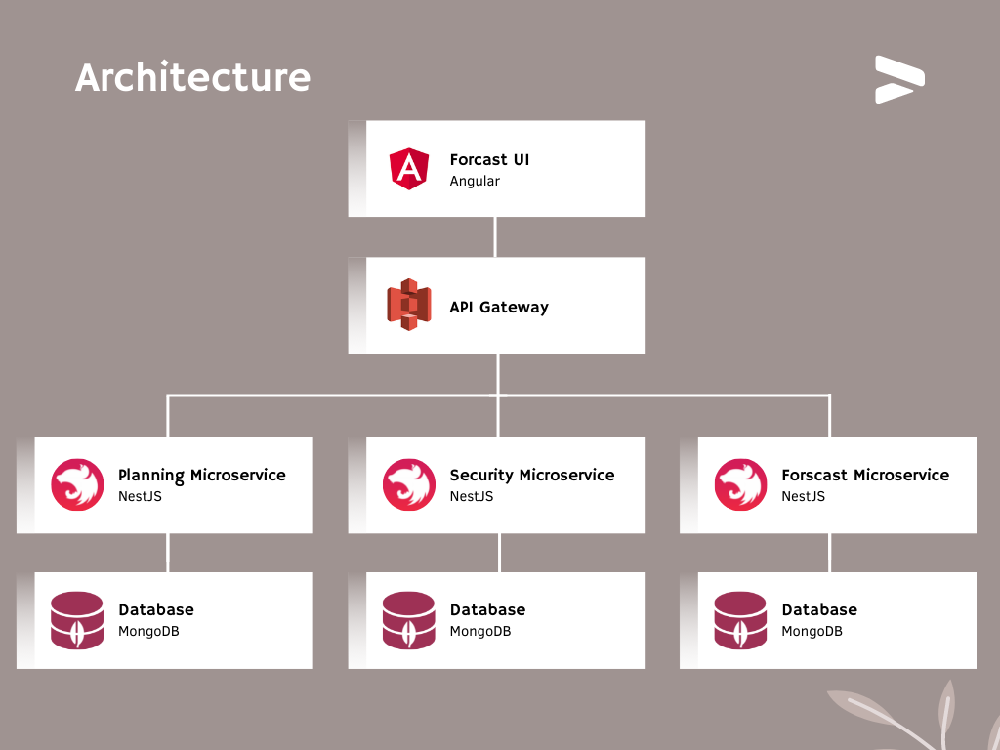

# Microservices Architecture Lab
A microservices architecture for software architecture lab

### Architecture
The application is composed:

- **Forecast UI:** The interfaces for the user to interact with the whole system.
- **Forecast Microservice:** Predict the sales of a specific product.
- **Security Microservice:** responsible for Authentication and Authorization.
- **Planning Microservice:** responsible for The creation of plans based on the generated forecast.
- **API Gateway:** Orchestrates requests from the client. All requests should pass through it.

